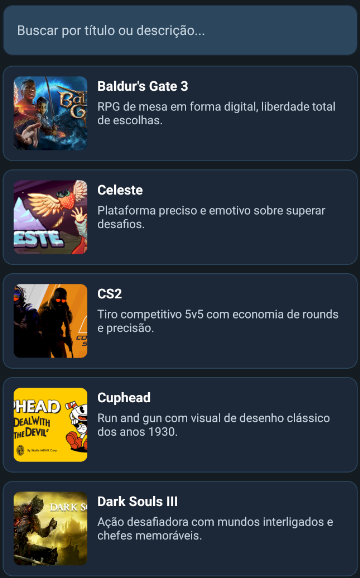
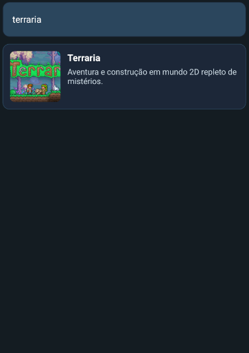

#  SteamDB

**Autores:** André Luis e Yolanda Candia  
**Disciplina:** Aplicações Móveis — IA2  
**Professor:** Brendo Vale

---

##  Contextualização

O **SteamDB** é um aplicativo mobile desenvolvido em **React Native com Expo**, inspirado na plataforma Steam.  
O objetivo do projeto é **listar e exibir informações de jogos**, permitindo busca por nome ou descrição e **armazenamento offline** dos dados utilizando **SQLite**.  

---

## Principais Funcionalidades

-  **Listagem de jogos** com título, imagem e descrição  
-  **Busca dinâmica** (filtra jogos pelo nome ou descrição)  
-  **Persistência offline com SQLite**  
- Os dados são armazenados localmente após o primeiro carregamento  
- Mesmo sem internet, o catálogo permanece disponível  
-  **Interface no estilo Steam**  
- Fundo escuro, tons azulados e visual moderno  
-  **Carregamento automático de catálogo local (games.json)**  

---

##  Tecnologias Utilizadas

**Expo / React Native**
**Android Studio**
**Chocolatey**
**TypeScript** 
**SQLite (expo-sqlite)** 
**Expo Router** 

---

##  Como Rodar o Projeto

### Clonar o repositório:
```bash
git clone https://github.com/drebao/IA-Aplicacoes-Moveis.git
cd IA-Aplicacoes-Moveis
```

### Instalar dependências:
```bash
npm install
```

### Rodar o app:
```bash
npx expo start
```

---

##  Guia de Uso

1. Ao abrir, a tela inicial exibe uma mensagem de boas-vindas e um botão **"Ir para Jogos"**.  
2. A tela principal mostra o **catálogo de jogos** com imagens e descrições.  
3. Use a **barra de busca** no topo para filtrar por nome ou palavras-chave.  
4. O app mantém o conteúdo mesmo **sem conexão com a internet**.  

---

## Recursos Visuais

| Tela Inicial | Lista de Jogos | Busca |
|---------------|----------------|--------|
|  |  |  |

---

##  Autores

- **André Luis**  
- **Yolanda Candia**

---
